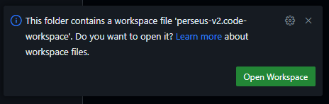

# Getting Started

This project is built using [Pixi](https://pixi.sh/), which makes getting started quite easy - all you have to do is install Pixi and `direnv`, and they take care of the rest.

## Conventions

### File Paths

Unless otherwise specified, file paths in these docs are relative to the repository root.
:::{example}
If you checked out the repository at `~/perseus-lite`, `docs/source/index.md` would refer to `~/perseus-lite/docs/source/index.md`.
:::

## First-time Setup

If you're on a Debian-based distro (like Ubuntu), you can run the `member-setup.sh` script, which will automatically set everything up for you. If you're not or you just want to, you can go through the steps manually (but you'll have to adjust the apt commands to suit your distro).

### Curl script

First, make sure you have `curl` installed:

```console
sudo apt-get update
sudo apt-get install curl
```

Then, you can run this command (it will prompt you for sudo permissions):

```console
curl https://raw.githubusercontent.com/DingoOz/perseus-lite/refs/heads/main/software/scripts/member-setup.sh | bash
```

Which automates the manual process described below. After you run this command, you may need to restart your shell to ensure `direnv` loads properly.
The script clones the repo into your home directory (~), so if you want it installed elsewhere, you should do it manually.

### Manual

1. Install the [GitHub CLI](https://github.com/cli/cli/blob/trunk/docs/install_linux.md).
2. Run the following shell commands to install `curl` and `direnv` (this assumes a Debian-based distro like Ubuntu):

```{code-block} console
sudo apt-get update
sudo apt-get install -y gh git curl direnv
```

3. Log into GitHub: `gh auth login -w -p https`
4. Clone (means to download a copy from the server to your machine) the repository (often referred to as repo) into `~/perseus-lite` and `cd` (change directory) into it:

```{code-block} console
cd ~
gh repo clone DingoOz/perseus-lite
cd perseus-lite
```

5. Install Pixi (it will prompt you for confirmation):

```{code-block} console
curl -fsSL https://pixi.sh/install.sh | bash
```

6. Restart your shell so `pixi` is on your `PATH`.
7. Set up the `direnv` shell hook so it activates the repo's Pixi environment automatically on `cd` - add `eval "$(direnv hook bash)"` (or the `zsh`/other-shell equivalent from the [direnv docs](https://direnv.net/docs/hook.html)) to your shell rc file, then restart your shell again.
8. Run `cd ~/perseus-lite` and run `direnv allow` (only needed once per clone) to let it load the repo's `.envrc`
9. Run `pixi install` to resolve and fetch the dev environment (large on first run)
10. Run `pixi run -e default build` - this will attempt to build the workspace. If this succeeds, you're done!

### IDE Setup

#### [VSCode](https://code.visualstudio.com/) (recommended)

Open the `perseus-lite/perseus-lite.code-workspace` workspace file (`File/Open Workspace from File`) and install all the recommended extensions.
This will install language support extensions (Python and C++), an extension for the formatter in use ([`treefmt`](https://github.com/numtide/treefmt), configured via the repo's `treefmt.toml`), and configure VSCode to respect the project settings.

:::{important}
You specifically need to open the `perseus-lite.code-workspace` file, not the folder, as otherwise settings won't apply.
In the event that you open the folder by mistake, VSCode will prompt you to open the workspace file:



Once you've opened the workspace, you should see `(WORKSPACE)` in your explorer (file view) title.
:::

Unfortunately, due to limitations in how `treefmt` works, it can only format files on save - this is fine, don't worry if you hit format and nothing happens.
Save it and try again!

At this point, you're all set up and ready to go.

#### Other (I)DEs

In the event that you're using another editor, you probably have enough technical know-how to set it up yourself.
As long as it uses the environment variables from the `direnv` setup, it should be able to find and run everything.
You should also configure your editor to use `treefmt` as its formatter - if you're using `direnv` or you're in a `pixi shell` environment (see the [next sections](#developing-software)), it (and the formatters it uses internally) will already be available in your shell.
Finally, you should configure your C/C++ LSP provider to recursively search in `${CONDA_PREFIX}/include` [^env-path] as part of its include path.
:::{example}
VSCode is configured with the include path `${env:CONDA_PREFIX}/include/**` added.
`${env:...}` tells it to substitute the value of that environment variable as-is, the `/include/` is simply directing it to the correct subdirectory, and finally `**` tells it to recursively search through all directories for files to include.
:::

[^env-path]: `CONDA_PREFIX` is an environment variable Pixi sets, containing the path to the currently-active Pixi environment. It contains all the tools and dependencies which get made available in the development environment.

:::{note}
You don't need to do anything Python support - the workspace sets `PYTHONPATH` by default.
:::

## Building the software

Run `pixi run -e default build`.
That's it.
No, really.
If that succeeds, that means that the entire project built successfully and you can now use it.
If, instead, you want an interactive shell, run `pixi shell` (or `pixi shell -e simulation` / `pixi shell -e machine-learning` for those environments).
After this runs, you'll be dropped into a sub-shell with the ROS 2 toolchain fully set up.
:::{note}
ROS2 command autocomplete works out of the box in a Pixi shell - RoboStack's `ros2-argcomplete` is sourced automatically as part of activating the environment, no extra setup step needed.
:::
:::{important}
`pixi shell` only sets up the ROS 2 toolchain (RoboStack's own `AMENT_PREFIX_PATH` entries) - it does **not** put the rover packages (`perseus_lite`, `input_devices`, etc.) on your path.
Run `source software/ros_ws/install/setup.bash` after `pixi shell` (or after the build finishes) to layer the colcon workspace overlay in, or the rover packages won't resolve for `ros2 launch`/`ros2 run`.
:::
At this point, you can run standard ROS2 commands, and all the rover packages are available like they've been installed.

## Developing Software

`direnv` automatically activates the Pixi environment (via the repo's `.envrc`, which runs `pixi shell-hook`) when you `cd` into the repo.
If you don't like `direnv`, you can alternatively run `pixi shell` to be dropped into a `bash` shell with everything fully set up, including autocomplete.
In this environment, you can either run `pixi run -e default build` to build the entire workspace, or you can `cd` to the ROS workspace root `software/ros_ws` and run `colcon build` just like you're developing in a standard ROS2 environment.
:::{important}
You must **always** run `colcon` inside the workspace root `software/ros_ws`, otherwise the configuration file may not apply properly.
:::
:::{note}
To the experienced ROS2 developers - you may notice the lack of a `--symlink-install` flag on the `colcon build` command - that's because it's configured using a [`colcon_defaults.yaml`](https://colcon.readthedocs.io/en/released/user/configuration.html#defaults-yaml) file present at `software/ros_ws/colcon_defaults.yaml` which adds this flag by default.
:::

### Before you start

However, before you start writing code, there's a few things you need to read through first.
The most important one is the software [systems](project:/systems/software-index.md), which goes over how all the software links together and how it's laid out.
The other document is the software [standards](project:/standards/software-index.md), which details the standards to which your software is expected to be written.
If your software _doesn't_ meet these standards, we unfortunately won't be able to merge your changes until you fix the issues - if code standards aren't enforced, the code **will** quickly become an un-maintainable mess, leading to another rewrite.

## Debugging

### ROS2 Nodes can't see each other on the network

Use the `talker` and `listener` nodes from the `demo_nodes_cpp` package to test this, with the talker on one device and the listener on another.
For some reason, the `ros2 multicast` commands mentioned in the standard ROS [troubleshooting guide](inv:ros#How-To-Guides/Installation-Troubleshooting) use a different port to the actual ROS2 DDS communications layer, and as such is not a reliable way to test - hence the use of `talker` and `listener` nodes.
This is almost certainly caused by firewall issues - specifically, blocking DDS discovery.
To allow ROS2 through the firewall on a system managed with `ufw`, run the following commands:

```{code-block} console
sudo ufw allow in proto udp to 224.0.0.0/4
sudo ufw allow in proto udp from 224.0.0.0/4
```

If you're on a system with a firewall _not_ managed by `ufw`, you probably already know how to do this yourself.
You need to allow UDP traffic to and from the address `224.0.0.0` with a mask of 4 bits (hence `224.0.0.0/4`), as this is the mask for [multicast addresses](https://en.wikipedia.org/wiki/Multicast_address).
:::{note}
In some cases, you may need to allow specific UDP ports through the firewall as well - if you're still having issues, let us know!
We'll help you debug it.
You can find a calculator for the ports in use [here](inv:ros#Concepts/Intermediate/About-Domain-ID) - just make sure to plug in the correct domain ID, as per the next section.
:::

### I installed ROS2 the normal way!

Firstly, you should really be using the Pixi setup as it manages dependencies for you automatically.
It coexists perfectly happily with a standard ROS install, since Pixi environments don't modify your system packages.
Secondly, you will probably experience `ROS_DOMAIN_ID` mismatches - this project currently defaults every Pixi environment's `ROS_DOMAIN_ID` to 51 for development (see `pixi.toml`'s `[activation.env]`).
:::{note}
A production/release `ROS_DOMAIN_ID` (42) split existed under the old Nix shells but has not yet been re-implemented under Pixi - every environment currently uses the dev domain. If you set the `ROS_DOMAIN_ID` environment variable manually, it will be used instead of the default in the dev shell.
:::

## Setup script details

For the curious among you, `software/scripts/member-setup.sh`, in order:

- Installs `gh`, `git`, and `direnv` via `apt-get`
- Logs into GitHub via `gh auth login` if not already authenticated
- Clones `DingoOz/perseus-lite` into `~/perseus-lite` if it isn't already present
- Installs Pixi (via the official `curl | bash` installer) if it isn't already on your `PATH`
- Runs `pixi install` to resolve and fetch the dev environment
- Runs `pixi run -e default build` to build the workspace

It does not modify your shell rc files or configure `direnv` for you - see the [manual setup](#manual) steps above for that.
